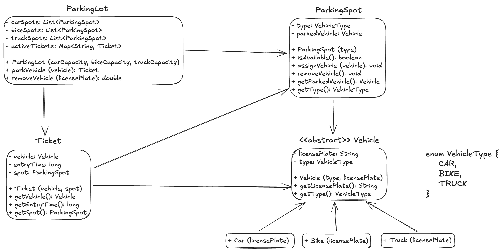

**Designing a Parking Lot System - Single Storey**

**Requirements**
1. The parking lot should have single levels with a certain number of parking spots.
2. The parking lot should support different types of vehicles, such as cars, bokes, and trucks.
3. Each parking spot should be able to accommodate a specific type of vehicle.
4. The system should assign a parking spot to a vehicle upon entry and release it when the vehicle exits.
5. The system should track the availability of parking spots and provide real-time information to customers.

**Classes, Interfaces and Enumerations**
1. The ParkingLot class follows the Singleton pattern to ensure only one instance of the parking lot exists. It provides methods to park and unpark vehicles.
2. The ParkingSpot class represents an individual parking spot and tracks the availability and the parked vehicle.
3. The Ticket class represents parkingSpot ticket cost based on VehicleType.
3. The Vehicle class is an abstract base class for different types of vehicles. It is extended by Car, Bike, and Truck classes.
4. The VehicleType enum defines the different types of vehicles supported by the parking lot.
5. Multi-threading is achieved through the use of synchronized keyword on critical sections to ensure thread safety.
6. The Main class demonstrates the usage of the parking lot system.