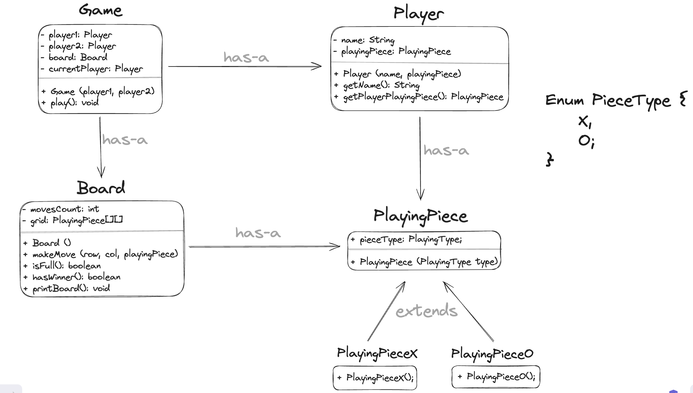

**TicTacToe - Low Level Design**

**Requirements**
1. The Tic-Tac-Toe game should be played on a 3x3 grid.
2. Two players take turns marking their symbols (X or O) on the grid.
3. The first player to get three of their symbols in a row (horizontally, vertically, or diagonally) wins the game.
4. If all the cells on the grid are filled and no player has won, the game ends in a draw.
5. The game should have a user interface to display the grid and allow players to make their moves.
6. The game should handle player turns and validate moves to ensure they are legal.
7. The game should detect and announce the winner or a draw at the end of the game.

**Classes**
1. The Player class represents a player in the game, with a name and a symbol (X or O).
2. The Board class represents the game board, which is a 3x3 grid. It provides methods to make moves, check for a winner, and check if the board is full.
3. The Game class manages the game flow and player interactions. It handles player turns, validates moves, and determines the winner or a draw.
4. The TicTacToe class is the entry point of the application and creates instances of the players and the game.

