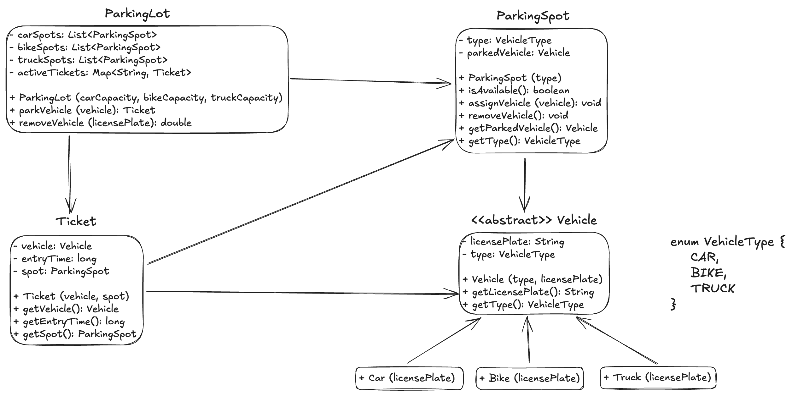

**Designing a Parking Lot System - Single Storey**

**Requirements**
1. Types of vehicles: Cars, Motorbikes, and Trucks.
2. Parking spaces: Each parking spot can accommodate only certain types of vehicles (e.g., car spots, bike spots, truck spots).
3. Parking lot capacity: The parking lot has a limited number of parking spots for each type of vehicle.
4. Ticket generation: When a vehicle enters, a ticket is generated.
5. Ticket payment and exit: When a vehicle leaves, it pays and exits the lot.
6. Parking spot availability tracking.

**Classes, Interfaces and Enumerations**
1. The ParkingLot class follows the Singleton pattern to ensure only one instance of the parking lot exists. Manages the entire parking lot, tracks available spots, assigns spots, and handles ticketing.
2. ParkingSpot: Represents individual parking spots.
3. Vehicle: Base class for different types of vehicles (Car, Bike, Truck).
4. Ticket: Represents a parking ticket generated when a vehicle enters.
5. ParkingFloor: Represents different floors of parking (optional, for scalability).
6. Payment: Handles payment for the parking.